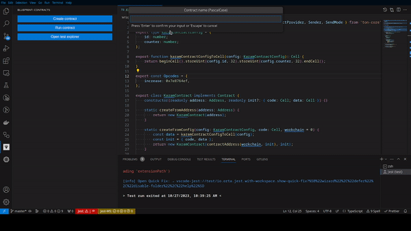

# Blueprint vscode extension README

## Features

Welcome to our Blueprint Visual Studio Code Extension! This extension is designed to streamline your development process by allowing you to build, test, and deploy Contracts directly within your VSCode environment. No longer do you need to switch between different tools or platforms - everything you need is right here. Enjoy a seamless, integrated development experience with our extension. Happy coding!

## Requirements

Install depencties with Yarn
`yarn install`
